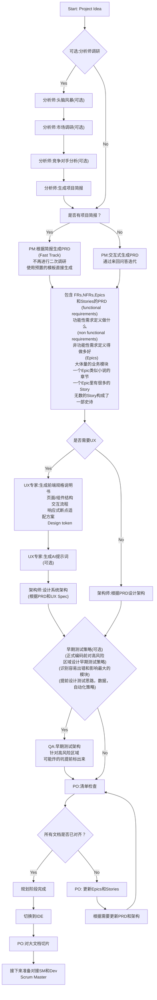

# User Guide

## The BMad Plan and Execute Workflow

首先，这是针对 Greenfield 项目的规划和执行工作流。Greenfield 在软件领域特指全新的没有历史包袱的项目，对应的 brownfield 项目指的是老旧的有历史包袱的项目。处理Brownfield 项目原理很相似，但还是建议先理解并实践一遍 Greenfield，再去应对更复杂的 Brownfield。BMad Method 需要安装在项目根目录。在规划阶段，使用思考能力更强的模型和更大的上下文窗口，同时把智能体当作真正的合作伙伴，才能获得更好的结果。

### The Planning Workflow

在正式开发前，BMad 会遵循一套结构化的规划流程，为了节省成本，这一步可以在 Web UI 中完成。



#### Web UI 规划阶段到 IDE 的过渡

**关键转折点**: 一旦PO确认了文档对齐没有问题之后，就必须从 Web UI 切换到 IDE 中的开发流程了:

1. 将 prd 和 architecture 复制到项目的docs目录，也可以在安装的时候指定自定义的目录
2. 在 IDE 让 PO 对 PRD 和 architecture 文档进行切片
3. 开始进行开发流程

#### 规划阶段的产物/工件

```text
PRD             -> docs/prd.md
Architecture    -> docs/architecture.md
Sharded Epics   -> docs/epics/
Sharded Stories -> docs/stories/
QA Assessments  -> docs/qa/assessments/ 过程质量报告
QA Gates        -> docs/qa/gates/ 发布前的许可证，质量门
```

### The Core Development Cycle (IDE)

规划阶段完成，并且文档被切片，BMad 接下来进入一个结构化的开发工作流

```mermaid
graph TD
  A["开始进入开发阶段"] --> B["SM:回顾上一条Story的开发
                                和QA的备注"]
  B --> B2["SM:草拟下一条Story
              根据拆好的Epics和系统架构"]
  B2 --> S{"Story是否高风险？
            (可选)"}
  S --> |Yes| T["QA: 对草拟的Story
                  用risk和design命令
                  risk评估实现风险
                  design制定测试策略"]
  S --> |No| B3
  T --> U["创建测试策略和风险画像
            risk profile"]
  U --> B3{"PO:是否再次检查草拟的
              Story(可选)"}
  B3 --> |再次检查| B4["PO:再次检查Story
                        使用规划阶段的产物"]
  B3 --> |跳过检查| C{"Story负责人是否拍板"}
  B4 --> C
  C --> |需要修改| B2
  C --> |确认没问题| D["Dev:按序执行任务"]
  D --> E["Dev:完成任务并测试"]
  E --> V{"开发途中是否需要QA检查?
            (可选)主要针对高风险任务"}
  V --> |No| F["Dev:执行全部校验"]
  V --> |Yes| W["QA:执行trace和nfr命令
                  trace对任务测试进行跟踪
                  nfr非功能性验证"]
  W --> X["Dev:填补没有覆盖的测试和
                没有达到的非功能性需求
                根据QA中途的反馈改进"]
  X --> F
  F --> G["Dev:标记任务为待评审
                附上自测记录、改动要点、
                已知风险等备注"]
  G --> H{"需求提出者或PO进行验证"}
  H --> |跳过QA直接通过| M["务必确认:
                          所有回归测试和
                          代码审查都必须通过
                          回归测试保证老功能正常
                          Linting保证代码符合规范"]
  H --> |请求QA评审| I["QA:根据测试框架评审
                          并通过Quality Gate"]
  I --> J["QA:分析并主动重构测试框架
            根据实际测试结果
            及时调整测试方案"]
  J --> L{"QA是否允许通过"}
  L --> |通过| M
  L --> |需要开发调整| D
  H --> |需要调整修复| D
  M --> N["务必确认:将所有改动提交
                    再进行下一个任务"]
  N --> Y{"之前测试给出的
          质量门结论是否需要更新"}
  Y --> |Yes| Z["QA:使用gate命令更新状态"]
  Y --> |No| K
  Z --> K["将该Story标记为完成"]
  K --> B
```



### BMad 有两个特殊的agent

#### BMad Master

IDE中万能的BMad agent，拥有所有agent的能力，不建议使用，可能造成大量的上下文开销

#### BMad Orchestrator

在 Web UI 中践行 BMad Method，是一个重量级的agent，随时能变换为别的agent

### BMad 中的 agents 是如何工作的?

#### 依赖管理系统

每个agent都有一个使用yaml语法生命的依赖清单

```yaml
dependencies:
  templates: // task 使用哪些模版来生成最后的文档
    - prd-template.md
    - user-story-template.md
  tasks: // 真正干活的命令
    - create-doc.md
    - shard-doc.md
  data: // 公共识库，可以理解为BMad内部的百科全书
    - bmad-kb.md // kb 是 knowledge base 知识库的缩写
```

**要点速记**

- agent 按需加载它们的资源，来保持精简的上下文
- 在打包的时候自动管理依赖，自动拉取需要的模板和知识库
- 资源通过在agents之间分享，保证了资源的一致性

#### 与 Agent 进行交互

**在IDE中**

```bash
# 在Cursor这些IDE中，可以使用@符号来与agent进行交互
@pm Create a PRD for a task management app
@architect design the system architecture
@dev implement the user authentication
# 在Claude Code中，使用/符号来进行交互
/pm create user stories
/dev fix the login bug
```

#### 交互模式

- 渐进模式：每一步都需要用户的输入确认
- YOLO(极速)模式: 以最少的交互快速生成并完成任务

## 与 IDE 整合

### IDE 最佳实践

- **管理上下文**: 只保留与当前任务相关的文件，保持精简，聚焦
- **agent 选择**: 要选择合适的 agent 来完成任务
- **迭代式开发**: 把任务拆小，一次专注完成一小块
- **文件组织**: 保持项目结构整洁，便于导航
- **定期提交**: 及时地保存工作内容

## The Test Architect(QA agent)

BMad 中的 QA agent 并不是“高级开发Code Review”这么简单, 它是一名专职的测试架构师。

- 精通整体测试策略，质量门控，基于风险的测试方法
- 对质量议题拥有一票否定式的建议权
- 当改动安全可控时，会主动重构代码和测试

### 基本的命令

```bash
@qa *risk {story} # 在开发前对Story进行风险评估
@qa *design {story} # 设计测试策略
@qa *trace {story} # 跟踪开发过程中的测试覆盖率
@qa *nfr {story} # 非功能性属性检查
@qa *review {story} # 完整评估，并给出是否放行的结论
```

### 基本的命令别名(测试架构师)

```text
*risk       -> *risk-profile
*design     -> *test-design
*nfr        -> *nfr-assess
*trace      -> *trace-requirements
*review     -> *review
*gate       -> *gate
```

### 核心能力

#### 1. 风险画像 Risk Profilling (*risk)

**最早介入点**: Story草稿完成后，正式开发之前

识别并评估实现的风险:

- **风险类别**: 技术，安全，性能，数据，业务，运维
- **评分方法**: 概率 x 影响分析，1-9分制
- **缓解措施**: 为每个已识别的风险制定具体措施
- **质量门行为**: 如果风险>=9分，直接FAIL拦下，不继续这个Story，如果风险>=6，则标记为CONCERNS，标识需要警示

#### 2. Test Design 测试设计 (*design)

**介入时机**: story草拟之后，正式开发之前，指导编写哪些测试

制定全面的测试策略包括:

- 为每条验收标准设计测试场景
- 推荐合适的测试等级(单元测试，集成测试，E2E端到端测试)
- 基于风险设定测试优先级(P0/P1/P2) P 是 Priority 的缩写，数字越小，风险越高，越要先测
  P0必测，P1速测，P2补测
- 需要的测试数据和Mock方案
- CI/CD执行策略: 在流水线里先执行哪类测试，失败如何快速回滚

什么是端到端测试呢？

把系统想象成一根水管，端到端就是测试整根水管的功能性，在软件领域，就是测试从用户输入到最底层的数据库的完整链路测试

**Example Output**

```yaml
test_summary:
  total: 24
  by_level:
    unit: 15
    integration: 7
    e2e: 2
  by_priority:
    P0: 8 # must have 与严重的风险相关
    P1: 10 # should have 中等风险
    P2: 6 # nice to have 低风险
```

#### 3. Requirements Tracing (*trace)

**When**: 开发期间（实施中期检查点）

映射需求与测试覆盖率:

- 记录了哪些测试验证了哪条验收标准
- 用 Given-When-Then 的句式让文档更清晰（只用于记录，并不是BDD代码）

  Given 场景前提
  When 触发动作
  Then 期望结果

  ```text
  Given 用户已登录
  When 点击“退出”按钮
  Then 系统应在 3 秒内返回登录页
  ```

  BDD (Behavior-Driven Development) 行为驱动开发
  ```
  场景：用户成功下单
    Given 用户已登录
    And   购物车里有一杯 15 元的奶茶
    When  用户点击“去结算”并支付 15 元
    Then  系统应在 3 秒内返回“下单成功”
    And   订单列表里出现该奶茶
  ```
- 识别出测试不足的地方，并按严重程度打分
- 创建可追溯矩阵，方便后续审计
  可追溯矩阵可以连接理解为需求-测试-结果的对照表，记录每个需求对应的测试文件/用例，以及最终的测试结果

#### 4. NFR Assessment 非功能性需求评估 (*nfr)

**When**: 开发过程中或者早期评审阶段 (验证各项质量属性)

验证以下非功能性需求:

- 最核心的四项: 安全Security，性能Performance，可靠性Reliability，可维护性Maintainability
- 证据优先: 必须提供实际代码，配置或测试结果作为证明，让每一项测试都可追溯，可复现
- 质量门联动: 任何NFR测试不合格，都会直接影响质量门的结果

#### 5. Comprehensive Test Architecture Review (*review) 全面的测试架构评审

当开发完成，Story标记为待评审

当你执行`@qa *review {story}`:

- 需求可追溯性: 将每条验收准则与实际的测试映射
- 分析测试等级: 确认单元，集成，端到端三个层级都安排了合适且足够的测试
- 测试覆盖评估: 找出漏测的和重复测的
- 主动重构: 如果安全的话会直接提升代码质量
- 质量门判定: 根据评审结果直接给出PASS/CONCERNS/FAIL 三种状态

#### 6. Quality Gates (*gate)

修复评审意见后，或需要更新质量门状态时，需要使用该命令

管理质量门决策:

- 明确规则: PASS/FAIL/CONCERNS 判定标准一目了然
- 并行权限: QA 独立掌控 docs/qa/gates 下的文件，拥有单独的权限
- 建议性质: 只给结论和建议，不强制阻塞流程
- 支持豁免: 可以根据需要记录可以被接受的风险

**注意** 质量门只是建议，团队可自行设置质量门槛，若想豁免，必须写清楚：原因，批注人，到期日

### Working with Test Architect

#### 与 BMad 工作流集成

测试工程师在整个开发生命周期中都发挥了价值。下面介绍什么时候，怎么用每个能力:

| **Stage**               |  **Command**  | **When to Use**             | **Value**                 | **Output**                                                     |
| ----------------------- |  -----------  | --------------------------- | ------------------------- | -------------------------------------------------------------- |
| **Story Drafting**      |   `*risk`     | 在SM草拟Story之后             | 尽早识别各种坑              | `docs/qa/assessments/{epic}.{story}-risk-{YYYYMMDD}.md`         |
|                         |   `*design`   | 风险评估之后                  | 指导测试策略的开发           | `docs/qa/assessments/{epic}.{story}-test-design-{YYYYMMDD}.md`  |
| **开发阶段**              |   `*trace`    | 开发期间                     | 验证测试覆盖率              | `docs/qa/assessments/{epic}.{story}-trace-{YYYYMMDD}.md`        |
|                         |   `*nfr`      | 构建功能的时候                 | 早些发现质量问题            | `docs/qa/assessments/{epic}.{story}-nfr-{YYYYMMDD}.md`           |
| **评审**                 |   `*review`   | 当Story标记为已完成时          | 全面的质量评估              | 在 story 和 gate 文件中的 QA 评审结果                              |
| **评审结束后**            |   `*gate`     | 修复问题以后                  | 更新质量评估结果            | 经过更新的 `docs/qa/gates/{epic}.{story}-{slug}.md`               |

命令示例:

```bash
# 规划阶段 - 在开发之前运行这些命令
@qa *risk {draft-story} # 有什么是容易做错的？
@qa *design {draft-story} # 我们应该有哪些测试

# 开发阶段 - 在编码的过程中使用这些命令
@qa *trace {story} # 是否完成了所有的测试
@qa *nfr {story} # 是否满足了质量标准

# 评审阶段 - 当开发完成
@qa *review {story} # 全面的评估和重构

# 评审之后 - 在指出问题之后
@qa *gate {story} # 更新质量门状态
```

### 强制执行的质量标准

Quinn 强制执行的测试质量原则:

- **No Flaky Tests** 没有薛定谔的测试: 通过正确的异步方法保证可靠性
- **No Hard Waits** 硬等待例如sleep(3): 只有动态的等待策略，更接近真实的测试场景
- **无状态，并行安全**: 所有的测试任务都单独执行
- **Self-Cleaning**: 每个测试任务管理自己的测试数据，测完了之后要负责清理数据
- **准确的测试等级**: 单元测试验证逻辑，集成测试验证功能之间的交互，端到端测试验证完整业务流程
- **显式断言**: 把断言写在测试本体中，而不是helper类，这样一眼就能看到在测什么

### 质量门状态概览

- **PASS**: 关键需求全部达标，无阻塞问题，可直接放行
- **CONCERNS**: 发现非关键问题，团队需评审决定是否进行处理
- **FAIL**: 存在必须修复的严重问题，例如安全风险，缺少P0测试
- **WALVED**: 团队已知晓问题，并明确主动放行该风险

### 特殊状况

**高风险的Story:**

- 总是要在开发前运行 `*risk` 和 `*design`
- 在开发中使用 `*trace` 和 `*nfr`

**复杂功能集成:**

- 使用 `*trace` 确保所有集成点都被测试覆盖
- 之后再用 `*nfr` 确保跨系统集成的性能等是否达标

**性能关键场景:**

- 在开发早期开始就经常性地使用`*nfr`跟踪实现质量
- 不要等到评审时才发现性能问题，这个时候该起来会很费劲

**老旧/遗留代码:**

- 先用 `*risk` 识别改动可能引发的回归风险
- 使用 `*review` 重点检查向后的兼容性