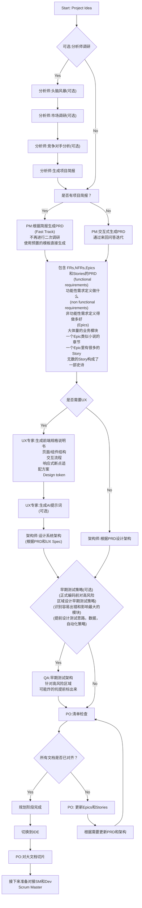

# User Guide

## The BMad Plan and Execute Workflow

首先，这是针对 Greenfield 项目的规划和执行工作流。Greenfield 在软件领域特指全新的没有历史包袱的项目，对应的 brownfield 项目指的是老旧的有历史包袱的项目。处理Brownfield 项目原理很相似，但还是建议先理解并实践一遍 Greenfield，再去应对更复杂的 Brownfield。BMad Method 需要安装在项目根目录。在规划阶段，使用思考能力更强的模型和更大的上下文窗口，同时把智能体当作真正的合作伙伴，才能获得更好的结果。

### The Planning Workflow

在正式开发前，BMad 会遵循一套结构化的规划流程，为了节省成本，这一步可以在 Web UI 中完成。



#### Web UI 规划阶段到 IDE 的过渡

**关键转折点**: 一旦PO确认了文档对齐没有问题之后，就必须从 Web UI 切换到 IDE 中的开发流程了:

1. 将 prd 和 architecture 复制到项目的docs目录，也可以在安装的时候指定自定义的目录
2. 在 IDE 让 PO 对 PRD 和 architecture 文档进行切片
3. 开始进行开发流程

#### 规划阶段的产物/工件

```text
PRD             -> docs/prd.md
Architecture    -> docs/architecture.md
Sharded Epics   -> docs/epics/
Sharded Stories -> docs/stories/
QA Assessments  -> docs/qa/assessments/ 过程质量报告
QA Gates        -> docs/qa/gates/ 发布前的许可证，质量门
```

### The Core Development Cycle (IDE)

规划阶段完成，并且文档被切片，BMad 接下来进入一个结构化的开发工作流

```mermaid
graph TD
  A["开始进入开发阶段"] --> B["SM:回顾上一条Story的开发
                                和QA的备注"]
  B --> B2["SM:草拟下一条Story
              根据拆好的Epics和系统架构"]
  B2 --> S{"Story是否高风险？
            (可选)"}
  S --> |Yes| T["QA: 对草拟的Story
                  用risk和design命令
                  risk评估实现风险
                  design制定测试策略"]
  S --> |No| B3
  T --> U["创建测试策略和风险画像
            risk profile"]
  U --> B3{"PO:是否再次检查草拟的
              Story(可选)"}
  B3 --> |再次检查| B4["PO:再次检查Story
                        使用规划阶段的产物"]
  B3 --> |跳过检查| C{"Story负责人是否拍板"}
  B4 --> C
  C --> |需要修改| B2
  C --> |确认没问题| D["Dev:按序执行任务"]
  D --> E["Dev:完成任务并测试"]
  E --> V{"开发途中是否需要QA检查?
            (可选)主要针对高风险任务"}
  V --> |No| F["Dev:执行全部校验"]
  V --> |Yes| W["QA:执行trace和nfr命令
                  trace对任务测试进行跟踪
                  nfr非功能性验证"]
  W --> X["Dev:填补没有覆盖的测试和
                没有达到的非功能性需求
                根据QA中途的反馈改进"]
  X --> F
  F --> G["Dev:标记任务为待评审
                附上自测记录、改动要点、
                已知风险等备注"]
  G --> H{"需求提出者或PO进行验证"}
  H --> |跳过QA直接通过| M["务必确认:
                          所有回归测试和
                          代码审查都必须通过
                          回归测试保证老功能正常
                          Linting保证代码符合规范"]
  H --> |请求QA评审| I["QA:根据测试框架评审
                          并通过Quality Gate"]
  I --> J["QA:分析并主动重构测试框架
            根据实际测试结果
            及时调整测试方案"]
  J --> L{"QA是否允许通过"}
  L --> |通过| M
  L --> |需要开发调整| D
  H --> |需要调整修复| D
  M --> N["务必确认:将所有改动提交
                    再进行下一个任务"]
  N --> Y{"之前测试给出的
          质量门结论是否需要更新"}
  Y --> |Yes| Z["QA:使用gate命令更新状态"]
  Y --> |No| K
  Z --> K["将该Story标记为完成"]
  K --> B
```



### BMad 有两个特殊的agent

#### BMad Master

IDE中万能的BMad agent，拥有所有agent的能力，不建议使用，可能造成大量的上下文开销

#### BMad Orchestrator

在 Web UI 中践行 BMad Method，是一个重量级的agent，随时能变换为别的agent

### BMad 中的 agents 是如何工作的?

#### 依赖管理系统

每个agent都有一个使用yaml语法生命的依赖清单

```yaml
dependencies:
  templates: // task 使用哪些模版来生成最后的文档
    - prd-template.md
    - user-story-template.md
  tasks: // 真正干活的命令
    - create-doc.md
    - shard-doc.md
  data: // 公共识库，可以理解为BMad内部的百科全书
    - bmad-kb.md // kb 是 knowledge base 知识库的缩写
```

**要点速记**

- agent 按需加载它们的资源，来保持精简的上下文
- 在打包的时候自动管理依赖，自动拉取需要的模板和知识库
- 资源通过在agents之间分享，保证了资源的一致性

#### 与 Agent 进行交互

**在IDE中**

```bash
# 在Cursor这些IDE中，可以使用@符号来与agent进行交互
@pm Create a PRD for a task management app
@architect design the system architecture
@dev implement the user authentication
# 在Claude Code中，使用/符号来进行交互
/pm create user stories
/dev fix the login bug
```

#### 交互模式

- 渐进模式：每一步都需要用户的输入确认
- YOLO(极速)模式: 以最少的交互快速生成并完成任务