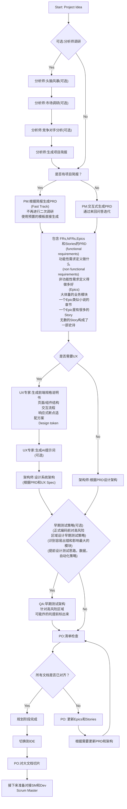

# User Guide

## The BMad Plan and Execute Workflow

首先，这是针对 Greenfield 项目的规划和执行工作流。Greenfield 在软件领域特指全新的没有历史包袱的项目，对应的 brownfield 项目指的是老旧的有历史包袱的项目。处理Brownfield 项目原理很相似，但还是建议先理解并实践一遍 Greenfield，再去应对更复杂的 Brownfield。BMad Method 需要安装在项目根目录。在规划阶段，使用思考能力更强的模型和更大的上下文窗口，同时把智能体当作真正的合作伙伴，才能获得更好的结果。

### The Planning Workflow

在正式开发前，BMad 会遵循一套结构化的规划流程，为了节省成本，这一步可以在 Web UI 中完成。

